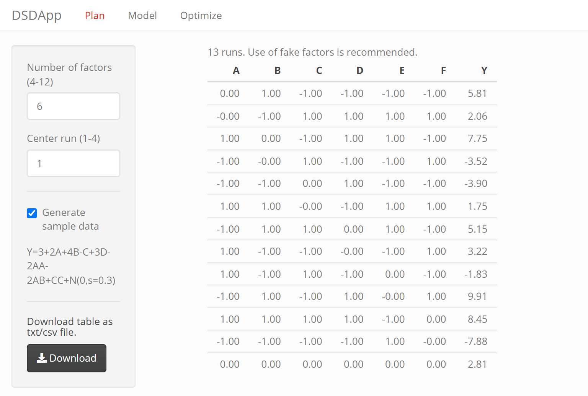
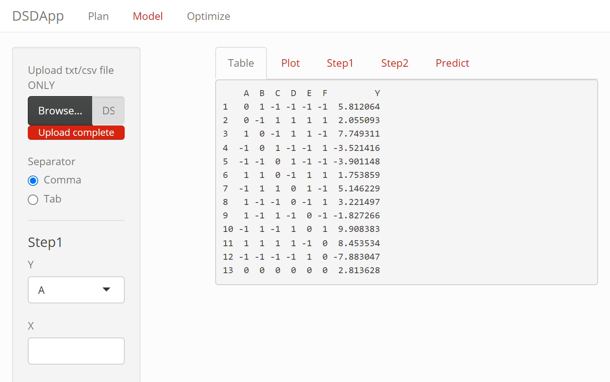
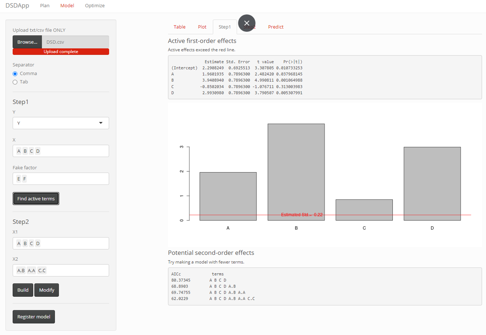
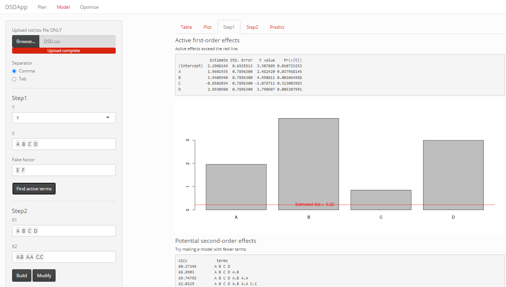
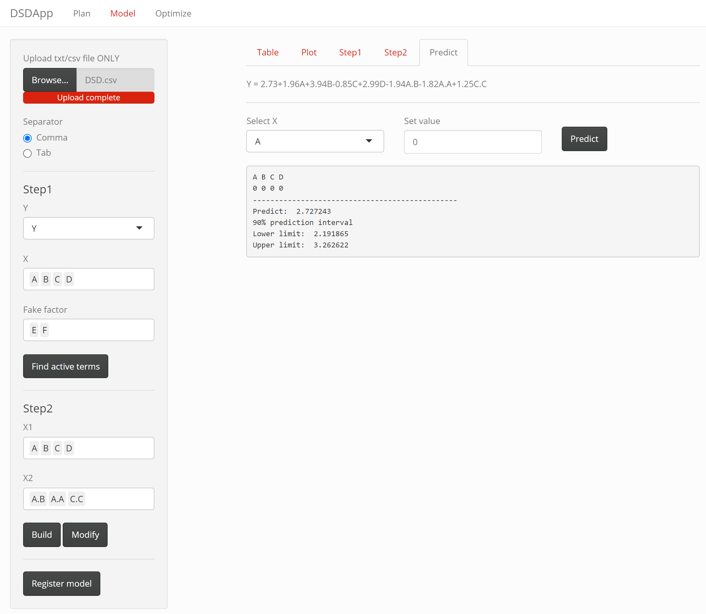
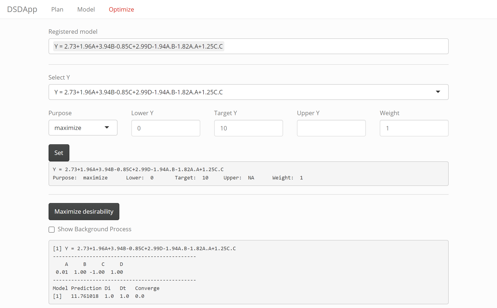
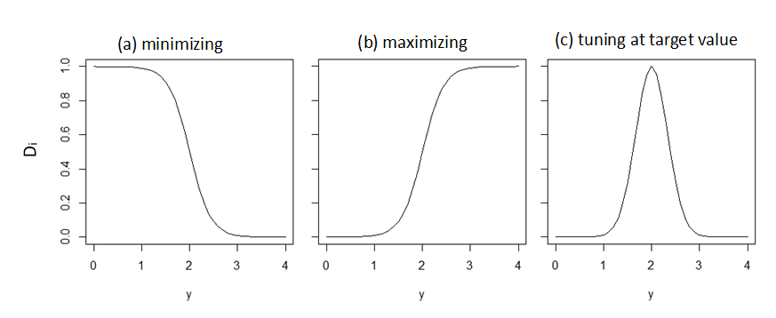

# DSDApp
Proposed by Jones and Nachtsheim in 2011, Definitive Screening Design (DSD) is one of the most efficient DOE techniques. DSDApp is a free web application to do the planning of DSD, model-making, and parameter optimization.

# Access
The app is open-accessed at https://my-first-dsd.shinyapps.io/DSDApp_ver2/.
To use it locally, download all the files in this repositry and run server.R on Rstudio.

# Plan
In the Plan tab, you can create a Definitive Screening Design (DSD) table with 4-12 factors, with 1-4 center run(s). A DSD table is an experiment design table used to identify the significant factors that affect a response variable. Figure 1 shows an example of a six-factor (A-F) DSD.

The factors of interest should be allocated in columns A-D. Factors are the variables you manipulate in your experiment, such as temperature or pressure. To enhance the power of detecting the effects of a factor, use the last two columns E and F for the so-called Fake Factors, to which no real factors are allocated. Fake factors are only used for analysis and help identify potential interactions or model deficiencies.


Your experiment should be done by changing the levels (low: -1, middle: 0, high: 1) of the factors following the DSD table. These levels represent the different settings for each factor, allowing you to test their effects on the response variable. 

The result of your experiment should be recorded and added in an extra column in the downloaded table. In Figure 2, instead of actual experiment data, sample data is given as an example. The data is produced by
```math
y=3+2A+4B-C+3D-2AA-2AB+CC+\varepsilon, \ \varepsilon \sim N(0,\sigma=0.3) \tag{1}. 
```

The table generated in this step can be downloaded by clicking on "Download." You can find this DSD table and the sample data in "DSD.csv". This file can be opened in any spreadsheet software, allowing you to analyze your data and draw conclusions from the experiment.


\
Figure 1. Planning DSD

# Model
In the Model tab, you can identify important factors and create second-order models in two simple steps.

## Upload Experiment Data
First, upload the results file, which includes the DSD table and the result column. For our example, we'll use "DSD.csv". Make sure the file is either a .txt or .csv format and that it appears correctly in the "Table" panel.

\
Figure 2. Upload experiment data

## Make Model
### Step1
To create models based on the uploaded data, you need to specify the output (Y), inputs (X), and fake factors. In our example, the output is Y, the inputs are A, B, C, and D, and the fake factors are E and F.

Click "Find active terms" to begin the calculation. The software will select the most important factors (first-order effects) that go beyond the red line in the graph.

Next, the software will choose second-order effects from combinations of the important factors. It will add these effects to the model one by one, using a forward stepwise method, to find the best model based on the minimum Akaike information criteria.

The selected main effects and second-order effects will show up in "X1" and "X2," respectively.

\
Figure 3. Finding active terms

### Step2
Click "Build" to create the model using the terms listed in "X1" and "X2." You can modify the model by manually selecting or deselecting terms in "X1" and "X2." By clicking "Modify," you can include factors that weren't automatically selected in Step 1.

You can evaluate the model in the "Step 2" panel. The "Model information" section in Figure 4 shows that the model's coefficients are similar to those in the original model (Eq.1). The bar graph displays the model term coefficients, while the plot at the bottom compares the actual and predicted values. If the points are on a straight line with a high adjusted R squared value, it means the model describes the data well.

\
Figure 4. Evaluating model

### Predict
The prediction of the output value based on the built model is possible. The input vector x (or the factor levels) can be set to specified values, as can be seen in Figure 5. The prediction value $y_{x_0}$ at $\boldsymbol{x_0}=[1,A,B,C,D]$ and its prediction interval is calculated as
```math
y_{x_0}\pm t_{\alpha/2, n-p}\sqrt{\sigma^2(1+\boldsymbol{x_0}(\boldsymbol{X}^t\boldsymbol{X})^{-1}\boldsymbol{x_0})},
```
where $\boldsymbol{X}$ is the design matrix of DSD, $\alpha$ is the significance level, $n$ is the number of runs, and $p$ is the number of terms in the model (including the intercept term). 

\
Figure 5. Prediction of output value

# Optimize
If you decide to use the model to optimize the input parameters for minimum, maximum, or target output value click on "Register model". The registered model shows up in the selector in Figure 6.

\
Figure 6. Optimization

The "Set" button defines the purpose (minimize/maximize/target), and lower or upper limits. For multiple output values, you need to register all the models and set their purposes of optimization individually.

The limits set here define the shape of the desirability function $D_i$ by the following equations. Figure 7 shows examples of the desirability function for different optimization purposes.

For minimizatin and maximization,
```math
D_i=\Big[1+99\exp⁡{\Bigl(y-\frac{y_{allowable}+y_{target}}{2}\Big)
\Big(\frac{2p}{y_{allowable}-y_{target}}\Big)}\Bigr]^{-1},
\\
p = \left\{
\begin{array}{ll}
-1 & (\rm{for}\ \rm{minimizing})\\
1 & (\rm{for}\ \rm{mazimizing})
\end{array}
\right.
```
For tuning to the target value,
```math
D_i=\left\{
    \begin{array}{ll}
    \exp\big[-\frac{(y-y_{target})^2}{2} \left(\frac{y_{target}-y_{lower}}{3}\right)^{-2}\big],
    & (y\le y_{target})
    \\
    \exp\big[-\frac{(y-y_{target})^2}{2} \left(\frac{y_{upper}-y_{target}}{3}\right)^{-2}\big]
    & (y\ge y_{target})
    \end{array}
    \right.
```

\
Figure 7. Desirability functions for different optimizations; (a) minimization, (b) maximization, and (c) tuning at $y_{target}$ = 2 with $y_{lower}$ = 1 and $y_{upper}$ = 3.


The optimization of the factor levels is performed by clicking "Maximize desirability."  For multi-objective optimization, the total desirability $D_t=\prod_{i}D_i$ is maximized. In the bottom pane in Figure 6, make sure that $D_i$ and $D_t$ are not zero; otherwise, optimization of output value(s) is not performed properly. The optimization is done by limited-memory quasi-Newton code for bound-constrained optimization (L-BFGS-B; the default function of “optim” in R language) and repeated ten times by changing the initial parameters.
